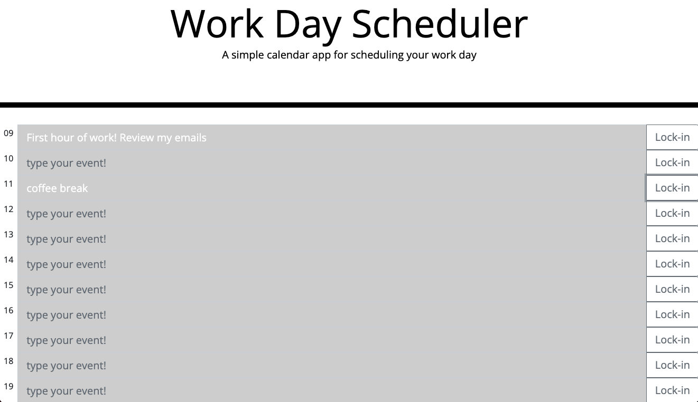

# 05 Work Day Scheduler

## Application

This simple calendar application allows a user to save events for each hour of the work day.

## User Story

AS an employee with a busy schedule, the user will be able to add important events to the work calendar which can be locked in and saved to local storage.

## Mock - Up

The following animation demonstrates the application functionality:

## Links

You are required to submit the following for review:

- The URL of the deployed application: https://ricardougarcia.github.io/work-day-calendar-21/

- The URL of the GitHub repository: https://github.com/ricardougarcia/work-day-calendar-21.git

---
